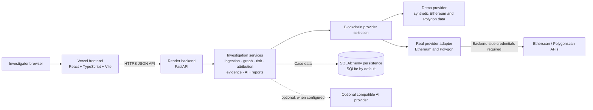

<div align="center">

# ChainGuard

### Blockchain Investigation &amp; Fraud Analysis Platform

An investigation workspace for examining wallet activity, tracing transaction flows, and organizing explainable risk signals, attribution hypotheses, and evidence.

[](https://www.python.org/)
[](https://fastapi.tiangolo.com/)
[](https://react.dev/)
[](https://www.typescriptlang.org/)
[](https://vite.dev/)
[](https://www.sqlalchemy.org/)
[](#blockchain-provider-configuration)

[Repository](https://github.com/shakthi-08/chaingaurd) · [Live dashboard](https://chaingaurd.vercel.app/) · [Backend service](https://chaingaurd.onrender.com) · [Hosting notes](HOSTING.md)

</div>

---

## Overview

Following cryptocurrency through multiple wallets and services can leave investigators with disconnected transactions, difficult-to-follow flows, and findings that are hard to review. ChainGuard brings wallet activity into a case workspace where transactions can be normalized, visualized, analyzed with deterministic rules, and collected into evidence and reports.

The repository is **demo-first**: the default provider is synthetic, and demo records are clearly marked. A real provider adapter exists for Ethereum and Polygon, but production provider credentials are intentionally not configured while security controls are being prepared. A healthy API response indicates backend reachability; it does not verify blockchain-provider access.

ChainGuard is an investigation aid. A risk signal is not a finding of fraud, and an attribution hypothesis is not proof of wallet ownership or criminal activity. Verify observations with appropriate primary sources and human review.

## Key features

| Capability | Implementation status | What it does today |
| --- | --- | --- |
| Wallet investigations | Implemented | Accepts a wallet and chain, validates input, creates or updates a case, and ingests activity through the configured provider. Demo investigations use synthetic data. |
| Transaction ingestion | Implemented with production limits | Normalizes native and token transfers. The real adapter supports Ethereum and Polygon, but production API keys are intentionally absent. |
| Fund-flow analysis | Implemented | Presents transaction movement and traced paths derived from case transactions. |
| Investigation graph | Implemented | Builds wallet and transaction relationships and supports bounded path tracing. |
| Risk and fraud analysis | Implemented as deterministic heuristics | Produces explainable indicators, findings, and alerts from observed case data. It is not a fraud classifier or proof of wrongdoing. |
| Attribution | Implemented as evidence-bounded matching | Compares wallets with available entity references and reports confidence, provenance, and hypotheses. Matches require investigator verification. |
| Evidence | Implemented | Collects deduplicated references from case data and accepts investigator-provided evidence records. |
| AI investigation | Optional / provider-dependent | Can summarize and explain case context through a configured compatible provider. It is unavailable by default and does not replace deterministic analysis. |
| Timeline | Implemented in the frontend | Derives a chronological view from transaction timestamps; there is no separate timeline API endpoint. |
| Reports | Implemented | Generates downloadable PDF reports from persisted case information. |
| Cross-chain analysis | Partial / demo-oriented | Correlates transactions using known deterministic bridge-event data; it is not a general live cross-chain indexer. |
| Live events | Demo-only | A WebSocket can stream demo events. Real-provider mode disables demo event streaming. |
| External complaint intake | Integration-ready, not live | The NCRP complaint routes accept and retrieve records locally; they do not connect to an external government system. |

## Screenshots

No product screenshots are currently tracked in this repository. Add reviewed captures here when they are available; no illustrative or generated screenshots are used in this README.

## Architecture

The browser UI is a React and TypeScript single-page application built with Vite. It calls a FastAPI backend for case operations. Backend services handle provider selection, ingestion, normalization, graph and risk analysis, attribution, evidence, and reports. SQLAlchemy persists the case data to SQLite by default.

The production frontend is hosted on Vercel and the backend service on Render. Deployment settings are managed by those platforms and are not defined in repository deployment manifests; see [HOSTING.md](HOSTING.md) for the project’s deployment configuration notes.

### Architecture diagram



Real-provider credentials are intentionally not configured in production. The diagram shows the adapter’s intended upstream connection, not verified live ingestion.

### Investigation workflow

```mermaid
flowchart TD
    submit[Submit wallet, chain, and optional time range]
    validate[Validate request fields, wallet format, and supported chain]
    select[Select demo or configured real provider]
    ingest[Fetch, normalize, and persist transaction activity]
    analyze[Run case analysis]
    graph[Build graph and trace transaction paths]
    findings[Calculate deterministic risk signals and attribution hypotheses]
    evidence[Collect evidence references and alerts]
    review[Review transactions, graph, risk, attribution, and timeline]
    report[Generate and download a PDF report]
    ai[Optional contextual AI explanations]

    submit --> validate --> select --> ingest --> analyze
    analyze --> graph --> findings --> evidence --> review --> report
    review -. optional, only when an AI provider is configured .-> ai
```

AI assistance is an optional explanation path. It does not change the deterministic risk calculation.

## Technology stack

| Area | Technologies verified in the repository |
| --- | --- |
| Frontend | React, TypeScript, Vite, React Flow, Lucide React |
| Frontend testing | Vitest, jsdom |
| Backend | Python, FastAPI, Uvicorn, Pydantic Settings |
| Persistence | SQLAlchemy ORM; SQLite is the default database URL |
| Reports | ReportLab PDF generation |
| Backend testing | pytest, FastAPI TestClient / HTTPX |
| Deployment | Vercel frontend and Render backend (deployment targets supplied for this project) |

Dependency versions are defined in [backend/requirements.txt](backend/requirements.txt) and [frontend/package-lock.json](frontend/package-lock.json). The frontend scripts are in [frontend/package.json](frontend/package.json).

## Getting started

### Requirements

- Python 3.12 or later
- Node.js 20 or later and npm
- Windows PowerShell for the commands below

### 1. Configure and start the backend

In a PowerShell terminal from the repository root:

```powershell
Set-Location .\backend
py -3.12 -m venv .venv
.\.venv\Scripts\Activate.ps1
python -m pip install -r requirements.txt
Copy-Item .env.example .env
```

For a local synthetic-data session, set these non-secret values in `backend/.env`:

```dotenv
ENVIRONMENT=demo
DEMO_MODE=true
BLOCKCHAIN_PROVIDER=demo
DATABASE_URL=sqlite:///./chainguard.db
AI_PROVIDER=none
```

Then start the API in that terminal:

```powershell
python -m uvicorn app.main:app --reload --port 8000
```

The demo seeder creates `CASE-DEMO-001` when demo mode is enabled. The health routes are available at `http://localhost:8000/health` and `http://localhost:8000/api/health`; FastAPI’s interactive API documentation is at `http://localhost:8000/docs`.

### 2. Start the frontend

Open a second PowerShell terminal from the repository root:

```powershell
Set-Location .\frontend
npm ci
npm run dev
```

Open [http://localhost:5173](http://localhost:5173). With frontend base variables unset, Vite proxies `/api` and `/ws` to the local backend.

## Environment configuration

Backend settings are loaded from environment variables and, when present in the backend working directory, `backend/.env`. The code defaults to `BLOCKCHAIN_PROVIDER=demo`; the local setup above explicitly enables demo seeding.

### Backend variables

| Variable | Purpose and code default |
| --- | --- |
| `APP_NAME` | Service display name; `ChainGuard`. |
| `APP_VERSION` | Service version; `0.1.0`. |
| `ENVIRONMENT` | Environment label; `development`. Set to `demo` to enable demo mode. |
| `DEBUG` | Debug setting; `false`. |
| `DEMO_MODE` | Enables demo seeding when true; `false` by default. |
| `BLOCKCHAIN_PROVIDER` | Provider selector; `demo` by default, or `real` when credentials and operational controls are in place. |
| `ETHERSCAN_API_KEY` | Optional backend-only credential for the Ethereum real-provider adapter. No value is included here. |
| `POLYGONSCAN_API_KEY` | Optional backend-only credential for the Polygon real-provider adapter. No value is included here. |
| `BLOCKCHAIN_API_TIMEOUT` | Provider request timeout in seconds; `30`. |
| `BLOCKCHAIN_PAGE_SIZE` | Provider page size; `200`. |
| `BLOCKCHAIN_MAX_PAGES` | Maximum provider pages; `1`. |
| `DATABASE_URL` | SQLAlchemy connection URL; `sqlite:///./chainguard.db`. |
| `API_PREFIX` | Configured API prefix; `/api`. Health and routers are also registered at unprefixed paths in the current app. |
| `CORS_ORIGINS` | Comma-separated allowed browser origins. The default includes localhost and the production Vercel origin. |
| `CORS_ORIGIN_REGEX` | Optional origin pattern; defaults to the repository’s Vercel preview pattern. |
| `AI_PROVIDER` | AI adapter selector; `none` by default. Supported settings include `openai`, `gemini`, `ollama`, and `openai-compatible`. |
| `AI_API_KEY` | Optional backend-only credential when the selected AI provider requires one. Never put it in a `VITE_*` variable. |
| `AI_MODEL` | Optional model override; provider-specific defaults are applied by the service. |
| `AI_BASE_URL` | Optional base URL for a compatible AI endpoint. |
| `AI_TIMEOUT` | AI request timeout in seconds; `60`. |

Do not commit `.env` files or paste real secrets into examples, issue reports, or browser configuration.

### Frontend variables

| Variable | Purpose |
| --- | --- |
| `VITE_API_BASE` | Backend origin used at frontend build time. The client appends `/api` unless the value already ends with `/api`. Leave unset for the local Vite proxy. |
| `VITE_WS_BASE` | Optional WebSocket backend origin. In production, omitting it disables live events. Live events are demo-only. |

Frontend variables are compiled into browser assets. **Never store blockchain-provider or AI secrets in frontend environment variables.**

## Blockchain provider configuration

The demo provider is the default and uses synthetic transaction records. The real provider adapter supports Ethereum and Polygon and requires the matching `ETHERSCAN_API_KEY` or `POLYGONSCAN_API_KEY` on the backend.

ChainGuard intentionally leaves blockchain-provider API keys **unconfigured in production** until access control, rate limiting, and abuse protections are ready. As a result, production real-provider ingestion is unavailable. Do not add provider keys to the frontend, commit them, or enable real ingestion merely to make the dashboard appear operational. A health check reports API reachability and configuration flags; it does not validate provider credentials or prove that a provider request succeeds.

## Security

### Existing safeguards

- Provider credentials are read by backend settings and used by backend provider code; the frontend does not need blockchain API keys.
- FastAPI/Pydantic validates request shapes and field lengths. Wallet ingestion checks hexadecimal wallet syntax and supported chains.
- Wallet ingestion bounds depth to three hops and limits discovered counterparties and visited wallets. Provider calls have a configurable timeout and pagination cap.
- CORS is configured for browser origins, with credentials disabled by default.

### Controls still needed before enabling production provider access

- **Authentication and authorization:** no API authentication or per-case access control was found on the current routes. Verify and implement these before exposing sensitive investigation data.
- **Rate limiting and abuse protection:** no application-level rate limiting was found. Add limits and monitoring for wallet ingestion, AI requests, reports, and other resource-consuming operations before enabling paid upstream providers.
- **Secret operations:** keep credentials in backend-only deployment secret settings, restrict access, rotate them, and prevent request logs or error reporting from capturing them.
- **CORS is not access control:** an origin allowlist does not authenticate a caller or prevent direct API requests.

These recommendations are not claims that the controls are already implemented. Treat the current public demo as a prototype; do not use it to store sensitive case material until access controls and operational safeguards have been reviewed.

## Testing

Run the backend suite from PowerShell:

```powershell
Set-Location .\backend
.\.venv\Scripts\Activate.ps1
python -m pytest tests -q
```

Run frontend tests and the production build from a second terminal:

```powershell
Set-Location .\frontend
npm test
npm run build
```

## Deployment

The project’s deployed entry points are [chaingaurd.vercel.app](https://chaingaurd.vercel.app/) and [chaingaurd.onrender.com](https://chaingaurd.onrender.com). Configure the Vercel frontend with `VITE_API_BASE` set to the backend origin, without a trailing slash; Vite injects this value when building the frontend. Set `VITE_WS_BASE` only if demo event streaming is desired. Never place backend credentials in Vercel frontend variables.

On Render, configure the backend’s non-secret runtime settings as needed and keep secrets in backend-only secret settings. Production blockchain-provider keys are intentionally not configured at this time. Ensure `CORS_ORIGINS` includes the exact deployed frontend origin; the default setting includes it, but an environment override can replace the default. Review `CORS_ORIGIN_REGEX` before relying on preview deployments.

Health checks:

- `GET https://chaingaurd.onrender.com/health`
- `GET https://chaingaurd.onrender.com/api/health`

Both health routes report backend health and configuration metadata. A successful response does not verify real-provider credentials, upstream availability, or transaction ingestion. Deployment notes are in [HOSTING.md](HOSTING.md).

## Known limitations

- Production real-provider ingestion is unavailable while its API keys are intentionally unconfigured.
- The default database is SQLite. Production durability, backups, and multi-instance database behavior are deployment concerns that must be reviewed for the chosen hosting setup.
- Risk signals are deterministic heuristics and are not validated fraud predictions.
- Attribution may be a hypothesis based on available references and must not be treated as confirmed wallet ownership.
- Cross-chain movement matching relies on limited known bridge data, including synthetic demo data; it is not general chain-wide bridge discovery.
- Demo WebSocket events are synthetic; live chain event streaming is not implemented.
- AI analysis is optional, provider-dependent, and unavailable when no supported provider is configured.
- The complaint intake API is an integration-ready local contract, not a live external agency integration.
- No API authentication, case-level authorization, or rate limiting was found in the current application routes.

## Roadmap

The following are planned improvements, not completed features:

- Add authentication, case-level authorization, audit trails, rate limits, and abuse monitoring.
- Evaluate durable production persistence, backups, and migration procedures.
- Enable real-provider ingestion only after provider credentials and operational controls are approved and tested.
- Expand provider and chain coverage with verifiable provenance and ingestion-health reporting.
- Improve explainability and evaluation of risk indicators and entity references with investigator feedback.
- Add deployment smoke checks and reviewed product screenshots.
- Build live event infrastructure and external complaint integrations only with approved security and operational designs.

## Contributing

Contributions are welcome. Open an issue to discuss substantial changes, then submit a focused pull request with tests for behavior changes. Run the backend and frontend checks listed under [Testing](#testing). Do not include secrets, real personal data, or unverified investigative allegations in commits or test fixtures.

## Responsible use

Use ChainGuard for authorized analysis and treat every result as a lead for human review. Synthetic/demo records must not be represented as real evidence. Validate transaction observations and entity references independently, preserve provenance, and follow the rules that apply to your investigation and jurisdiction.

## License

No `LICENSE` file is currently present in the repository. No license is asserted by this README; add a license only after the project owner chooses one.

## Disclaimer

ChainGuard is an evolving software project and is provided without a guarantee of accuracy, availability, or fitness for a particular investigation. It does not determine legal responsibility, establish wallet ownership, or replace professional investigative judgment. Demo data is synthetic, and all analytical outputs require independent verification.
